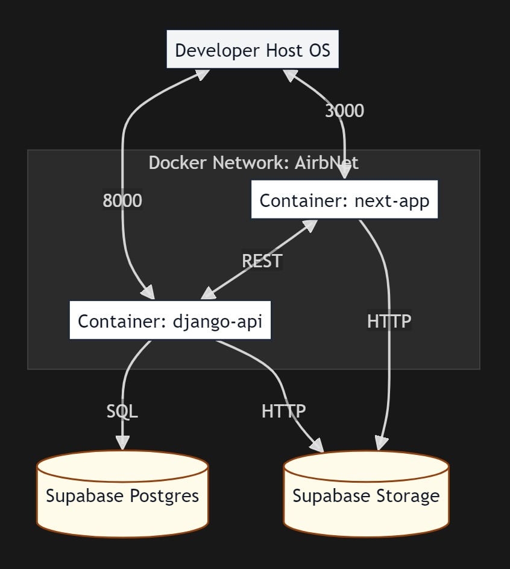
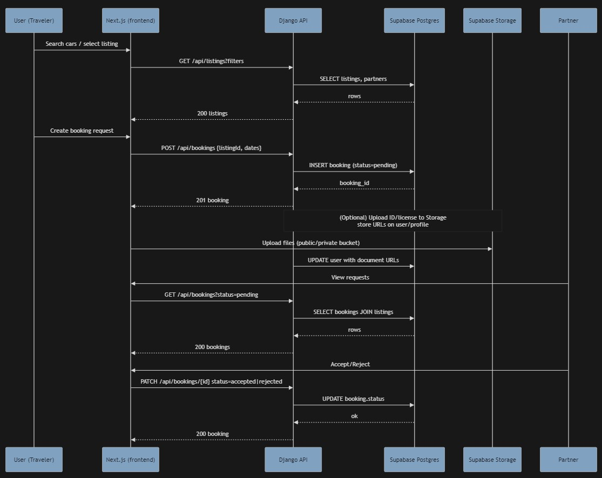
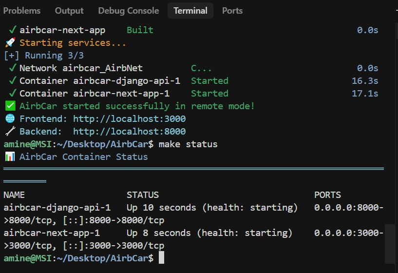
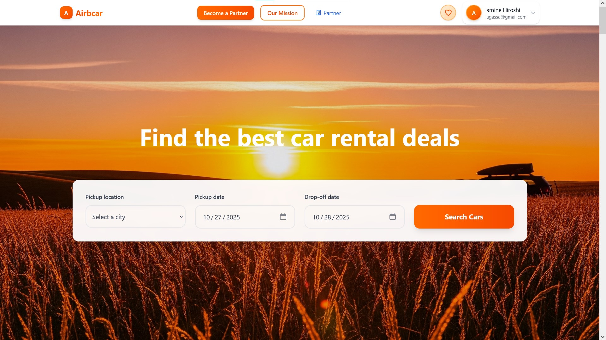
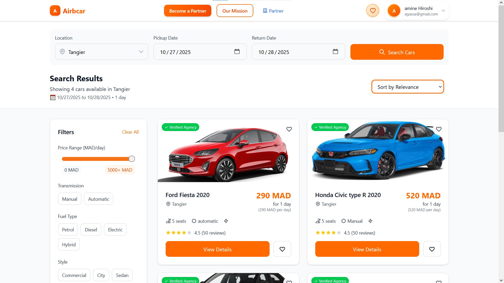
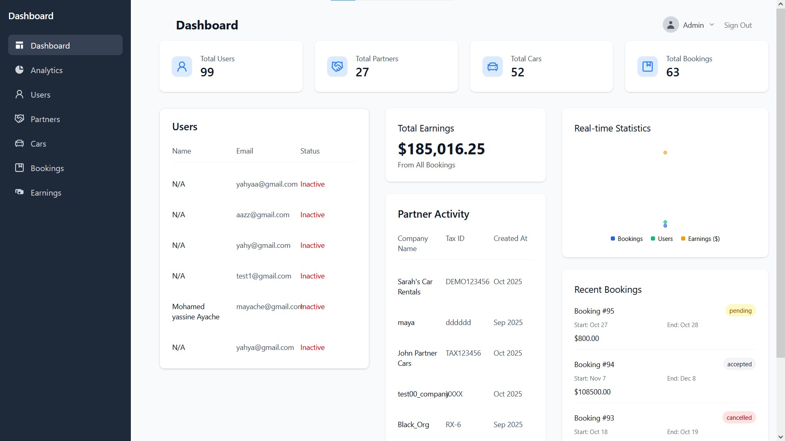
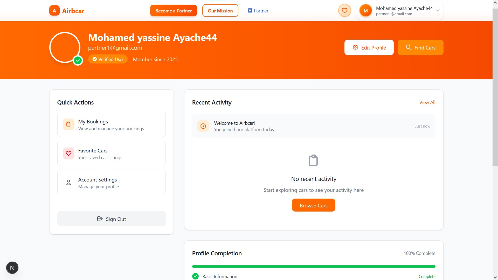
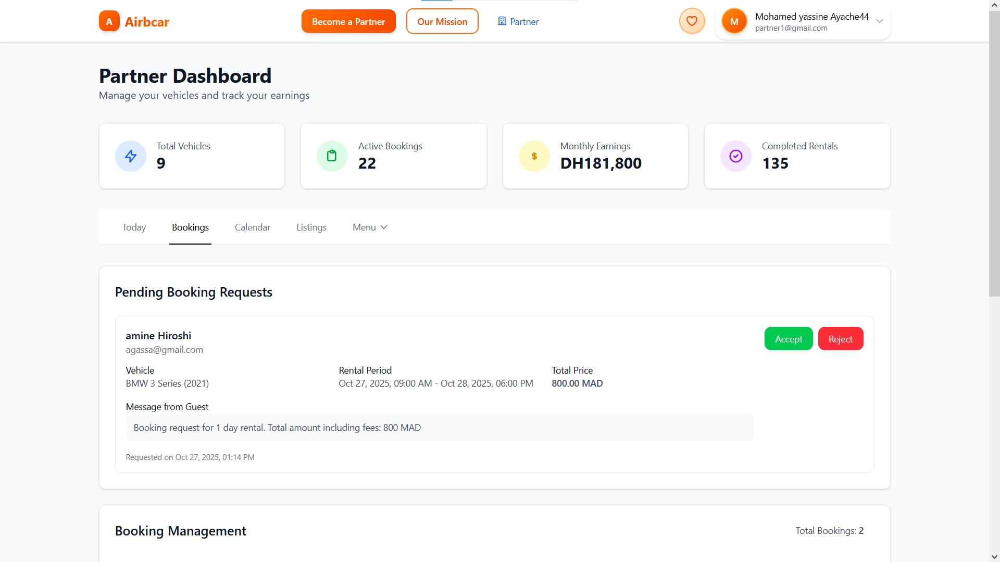
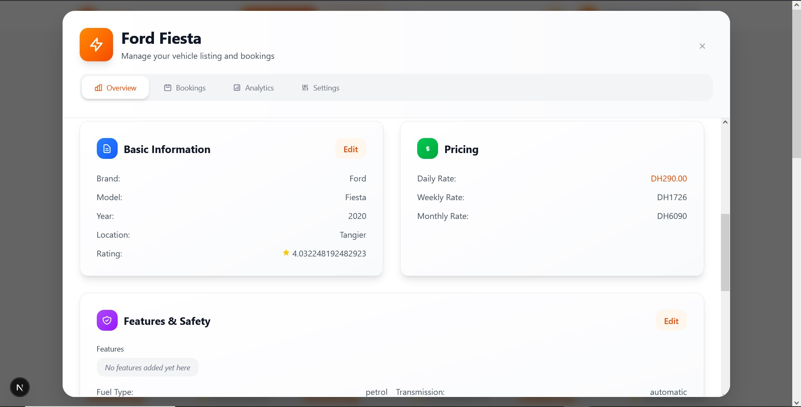

# AirbCar

Simple car rental app. Frontend is Next.js. Backend is Django REST API. You can run it in two ways:

- Local mode: uses a local Postgres in Docker. This is for anyone who wants to try the app. No private keys needed.
- Remote mode: uses a remote Supabase database. This is only for owners who have the private `.env.local` file.

### Screenshots
<p align="center">
    
    
    
    
    
    
    
    
     
</p>

## Quick start (visitors)

If you just want to test the app, use local mode.

Note: Ensure Docker (e.g., Docker Desktop) is installed and running before you start.

```bash
git clone https://github.com/Tourisoo/AirbCar.git
cd AirbCar
make local
```

This will:

- Copy `.env.local.example` to `.env.local` for you
- Start the frontend, backend, and a Postgres container
- Open the app on your machine

Open these URL:
- Frontend: http://localhost:3000

Users to test with:
- USER:    test@example.com | test123
- PARTNER: partner@example.com | partner123

Note: when local mode starts, the temporary `.env.local` file is created and later removed by the command. You do not need to manage it.

## Requirements

- Docker and Docker Compose
- Git

## Commands

- Start local mode:

  ```bash
  make local
  ```

- Start remote mode (owners only, needs private `.env.local`):

  ```bash
  make run
  ```

- Check running containers:

  ```bash
  make status
  ```

- Follow logs:

  ```bash
  make logs
  ```

- Stop services:

  ```bash
  make stop
  ```

- Clean containers and volumes:

  ```bash
  make clean
  ```

- Full clean (also remove images):

  ```bash
  make fclean
  ```

- Rebuild images:

  ```bash
  make build
  ```

## Remote mode (owners)

Remote mode runs the frontend and backend in Docker, and connects to a Supabase Postgres database. Only owners with the private `.env.local` can use this.

Steps:

1. Place your owner `.env.local` at the project root (same folder as `Makefile`). Do not commit this file.
2. Start remote mode:

   ```bash
   make run
   ```

What runs:

- Next.js on port 3000
- Django on port 8000
- Database is remote in Supabase (not a local container)

## Services and ports

- Frontend: http://localhost:3000
- Backend: http://localhost:8000

## Project layout (short)

```
AirbCar/
  backend/                # Django project and app code
  frontend/               # Next.js app
  docker-compose.yml      # Services and networks
  Makefile                # Commands listed above
  images/                 # Screenshots
```

## Tips

- If ports 3000 or 8000 are busy, stop the other app that uses them or change ports locally.
- Use `make logs` and `make status` to debug.
- If you want a fresh start, run `make clean` or `make fclean`.

## Use Policy & Status

**Status:** This repository is **PUBLIC** for demonstration and portfolio viewing purposes only.

**License:** **ALL RIGHTS RESERVED.** No license is granted for reproduction, modification, distribution, or commercial use of the source code contained herein.

**Testing:** You are permitted to clone and run the application locally (via `make local`) solely for testing, review, and personal assessment of the project's functionality.